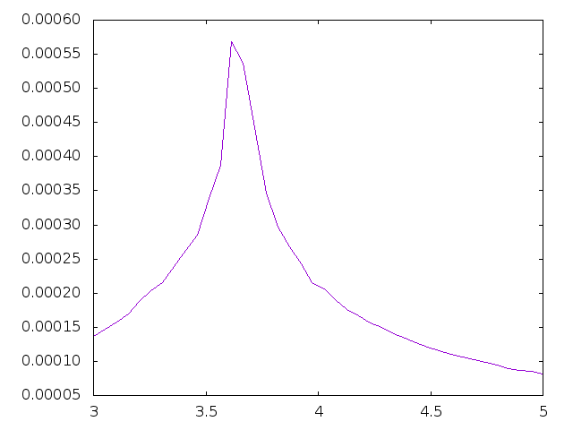

# Midterm 2
## Collaborators: Basant Kandel & Christine Caron
The code produced in this project was created to estimate the temperature of the phase transitions of the 
two-dimensional ferromagnetic Ising model on a triangular lattice with nearest neighbor interactions. The structure and main skeleton
of the code is provided from our class professor and was redefined to scan not just 4 neighbors, but six neighbors. After all of the changes 
were implemented in the code I ran the program for a 64X64 grid lattice and produced 40 points for each energy to put on the graph.
The graph as seen below has a definitive maximum energy which can be seen clearly when using more data points.

